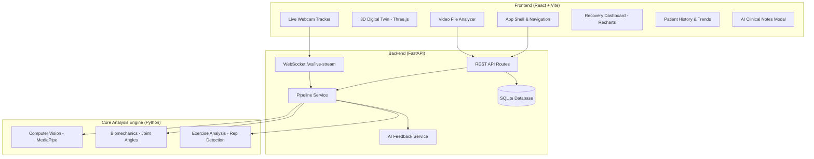
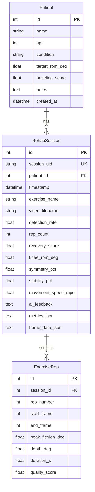

<p align="center">
  
  
  
  
  
  
  
</p>

# 🦾 AI Musculoskeletal Digital Twin for Rehabilitation

> **An intelligent, full-stack biomechanics platform that transforms exercise video into actionable clinical rehabilitation insights using computer vision, kinematic analysis, and an interactive 3D digital twin.**

⚠️ **Disclaimer:** This is a portfolio/research prototype. It is **not a clinically validated medical system** and should not be used for medical diagnosis or treatment decisions.

---

## 📋 Table of Contents

- [Overview](#-overview)
- [Key Features](#-key-features)
- [System Architecture](#-system-architecture)
- [Tech Stack](#-tech-stack)
- [Project Structure](#-project-structure)
- [Getting Started](#-getting-started)
  - [Prerequisites](#prerequisites)
  - [Installation](#installation)
  - [Running the Application](#running-the-application)
  - [Running Tests](#running-tests)
- [Application Modules](#-application-modules)
  - [Computer Vision Pipeline](#1-computer-vision-pipeline)
  - [Biomechanics Engine](#2-biomechanics-engine)
  - [Exercise Analysis](#3-exercise-analysis)
  - [AI Clinical Feedback](#4-ai-clinical-feedback)
  - [Backend API](#5-backend-api)
  - [Frontend Dashboard](#6-frontend-dashboard)
- [API Reference](#-api-reference)
- [Database Schema](#-database-schema)
- [Screenshots & UI Features](#-screenshots--ui-features)
- [Configuration & Environment](#-configuration--environment)
- [Known Limitations](#-known-limitations)
- [Roadmap](#-roadmap)
- [Contributing](#-contributing)
- [License](#-license)

---

## 🔬 Overview

The **AI Musculoskeletal Digital Twin** is an end-to-end rehabilitation monitoring platform that creates a personalized digital representation of a patient's musculoskeletal system. It processes exercise videos (or live webcam feeds) through a multi-stage pipeline:

```
┌──────────┐    ┌──────────────┐    ┌────────────────┐    ┌──────────────────┐    ┌─────────────────┐
│  VIDEO   │───▶│  MediaPipe   │───▶│ Joint Angle    │───▶│ Exercise Analysis│───▶│ AI Clinical     │
│  INPUT   │    │  Pose Est.   │    │ Biomechanics   │    │ Rep Detection    │    │ Feedback        │
└──────────┘    │  33 Landmarks│    │ ROM/Symmetry   │    │ Recovery Score   │    │ Recommendations │
                └──────────────┘    └────────────────┘    └──────────────────┘    └─────────────────┘
                                                                                          │
                                                          ┌──────────────────┐             │
                                                          │  3D Digital Twin │◀────────────┘
                                                          │  React + Three.js│
                                                          │  Live Dashboard  │
                                                          └──────────────────┘
```

The platform enables physiotherapists and rehabilitation specialists to:
- **Track** patient exercise form in real-time via webcam or uploaded video
- **Analyze** joint angles, range of motion (ROM), bilateral symmetry, and movement stability
- **Visualize** a 3D digital twin avatar that mirrors the patient's joint kinematics
- **Generate** AI-powered clinical feedback with actionable rehabilitation recommendations
- **Monitor** longitudinal recovery trajectories across multiple sessions

---

## ✨ Key Features

### 🎯 Computer Vision & Pose Estimation
- Real-time 33-landmark body pose extraction using **Google MediaPipe**
- Support for video file upload (MP4, AVI, MOV) and live webcam streaming
- Frame-by-frame landmark coordinate extraction with visibility scoring

### 📐 Biomechanics Analysis Engine
- **6 Joint Angles** computed per frame: left/right knee, hip, and ankle
- **Range of Motion (ROM)** measurement with min/max angle tracking
- **Bilateral Symmetry Index** — percentage difference between left/right limb kinematics
- **Stability Score** — derived from joint trajectory smoothness (jerk-based metric)
- **Angular Velocity** — per-joint movement speed estimation

### 🏋️ Exercise Analysis & Rep Detection
- Automatic **rep counting** using a state-machine approach on knee angle trajectories
- Per-rep quality scoring based on depth, consistency, and peak flexion
- Composite **Recovery Score** (0–100) computed from ROM, symmetry, and stability
- Squat and knee flexion exercise pattern recognition

### 🤖 AI Clinical Feedback System
- Rule-based clinical intelligence engine producing structured feedback
- **ROM Evaluation** — functional threshold assessment against target goals
- **Symmetry Warnings** — detection of compensatory weight shifting
- **Stability Assessment** — neuromuscular control and trajectory jerk analysis
- **Personalized Recommendations** — exercise modifications and progression guidance
- Status classification: Optimal / Satisfactory / Needs Intervention

### 🧍 3D Digital Twin Visualization
- Interactive **Three.js** humanoid avatar with real-time joint articulation
- Session playback with scrubbing timeline and play/pause controls
- Color-coded joint stress indicators (green/amber/red)
- Bilateral symmetry visualization with split-body coloring
- Camera orbit controls for 360° inspection

### 📊 Clinical Analytics Dashboard
- **Recharts**-powered interactive data visualization
- Joint angle time-series graphs with multi-joint overlay
- Per-rep analysis cards with quality indicators
- Recovery score gauge with trend indicators
- Session comparison and longitudinal trajectory tracking

### 🔴 Real-Time WebSocket Tracking
- Live webcam feed with **MediaPipe** landmark overlay
- WebSocket-based real-time telemetry streaming to backend
- Instant joint angle computation and rep state machine
- Live feedback overlay during exercise execution

### 📝 Patient Management
- Multi-patient support with individual profiles and conditions
- Per-patient target ROM and baseline scores
- Session history with trend analysis
- Demo patients pre-seeded for immediate exploration

---

## 🏗 System Architecture



---

## 🛠 Tech Stack

### Backend
| Technology | Version | Purpose |
|---|---|---|
| **Python** | 3.10+ | Core runtime |
| **FastAPI** | 0.110+ | REST API framework with auto-generated docs |
| **Uvicorn** | 0.29+ | ASGI server |
| **SQLAlchemy** | 2.0+ | ORM & database toolkit |
| **SQLite** | Built-in | Lightweight embedded database |
| **MediaPipe** | 0.10.13 (pinned) | Pose estimation — 33 body landmarks |
| **OpenCV** | 4.9+ | Video frame processing |
| **NumPy** | 1.26+ | Numerical computation |
| **Pandas** | 2.2+ | Data manipulation & landmark DataFrames |

### Frontend
| Technology | Version | Purpose |
|---|---|---|
| **React** | 19 | Component-based UI framework |
| **Vite** | 8.2+ | Fast build tooling & dev server |
| **Three.js** | 0.185 | 3D digital twin rendering |
| **Recharts** | 3.10+ | Interactive data visualization charts |
| **Lucide React** | 1.38+ | Icon library |

---

## 📁 Project Structure

```
rehab-digital-twin/
│
├── backend/                          # FastAPI Backend Application
│   ├── main.py                       # App entrypoint, CORS, router mounting, startup seeding
│   ├── database.py                   # SQLAlchemy engine & session factory (SQLite)
│   ├── models.py                     # ORM models: Patient, RehabSession, ExerciseRep
│   ├── schemas.py                    # Pydantic request/response schemas
│   ├── routers/
│   │   ├── patients.py               # Patient CRUD + trend analysis endpoints
│   │   ├── sessions.py               # Session CRUD, video upload, synthetic generation
│   │   └── ws_live.py                # WebSocket endpoint for real-time pose telemetry
│   └── services/
│       ├── pipeline_service.py       # Orchestrates CV → Biomechanics → Analysis pipeline
│       └── ai_feedback_service.py    # Clinical feedback generation engine
│
├── computer_vision/                  # Phase 1 — Pose Estimation
│   └── pose_estimation.py            # MediaPipe Pose → 33 landmarks → CSV extraction
│
├── biomechanics/                     # Phase 2 — Kinematic Analysis
│   ├── joint_angles.py               # 3-point angle calculation, ROM, symmetry, stability
│   └── exercise_analysis.py          # Rep detection, recovery scoring, session analysis
│
├── frontend/                         # React + Vite Frontend Application
│   ├── package.json                  # Node.js dependencies & scripts
│   ├── vite.config.js                # Vite dev server config with API proxy
│   ├── index.html                    # HTML entry point
│   └── src/
│       ├── main.jsx                  # React DOM root mount
│       ├── App.jsx                   # Main app shell with tab navigation & state management
│       ├── App.css                   # Component-specific styles
│       ├── index.css                 # Global design system (dark theme, glassmorphism)
│       └── components/
│           ├── DigitalTwin3D.jsx     # Three.js 3D humanoid avatar with joint articulation
│           ├── LiveTracker.jsx       # Webcam MediaPipe tracker with WebSocket telemetry
│           ├── VideoAnalysis.jsx     # Video file upload & analysis trigger
│           ├── RecoveryDashboard.jsx # Recharts analytics (angles, reps, scores)
│           ├── Simulator.jsx         # Synthetic session generator with parameter controls
│           ├── PatientHistory.jsx    # Longitudinal session timeline & trends
│           └── ClinicalNotes.jsx     # AI-generated clinical feedback modal
│
├── opensim/                          # Phase 4 — Musculoskeletal Modeling (placeholder)
│   └── .gitkeep
│
├── ml/                               # Phase 5/6 — Machine Learning (placeholder)
│   └── .gitkeep
│
├── data/
│   ├── raw/                          # Input videos & uploaded files
│   ├── processed/                    # Extracted landmark CSVs
│   ├── features/                     # Computed biomechanics features & reports
│   └── rehab_twin.db                 # SQLite database (auto-created)
│
├── notebooks/                        # Jupyter notebooks for exploration
├── tests/
│   └── test_mvp_pipeline.py          # End-to-end pipeline test with synthetic data
│
├── run_mvp.py                        # CLI: video → landmarks → angles → score
├── start_app.py                      # One-command full-stack launcher
├── requirements.txt                  # Python dependencies
├── .gitignore                        # Git ignore rules
└── README.md                         # This file
```

---

## 🚀 Getting Started

### Prerequisites

- **Python 3.10+** — [Download](https://www.python.org/downloads/)
- **Node.js 18+** and **npm** — [Download](https://nodejs.org/)
- **Git** — [Download](https://git-scm.com/)

### Installation

**1. Clone the repository**

```bash
git clone https://github.com/Gaut2812/rehab-digital-twin.git
cd rehab-digital-twin/rehab-digital-twin
```

**2. Set up Python virtual environment**

```bash
# Create virtual environment
python -m venv .venv

# Activate it
# On Windows:
.venv\Scripts\activate
# On macOS/Linux:
source .venv/bin/activate

# Install Python dependencies
pip install -r requirements.txt

# Install additional backend dependencies (FastAPI stack)
pip install fastapi uvicorn[standard] sqlalchemy
```

**3. Install frontend dependencies**

```bash
cd frontend
npm install
cd ..
```

### Running the Application

#### Option A: One-Command Launcher (Recommended)

```bash
python start_app.py
```

This will:
1. Start the **FastAPI backend** on `http://127.0.0.1:8000`
2. Start the **Vite dev server** on `http://localhost:5173`
3. Open your browser automatically

#### Option B: Manual Start (Two Terminals)

**Terminal 1 — Backend:**
```bash
cd rehab-digital-twin
python -m uvicorn backend.main:app --host 127.0.0.1 --port 8000 --reload
```

**Terminal 2 — Frontend:**
```bash
cd rehab-digital-twin/frontend
npm run dev
```

Then open **http://localhost:5173** in your browser.

#### Option C: CLI Pipeline Only (No Web UI)

```bash
# Process a video file through the analysis pipeline
python run_mvp.py data/raw/exercise.mp4 --session-id session_1
```

**CLI Outputs:**
| File | Description |
|---|---|
| `data/processed/pose_landmarks.csv` | Raw per-frame landmarks (Phase 1) |
| `data/features/biomechanics_frame_level.csv` | Per-frame joint angles (Phase 2) |
| `data/features/session_report.json` | Reps, ROM, symmetry, stability, recovery score (Phase 2+3) |

### Running Tests

```bash
python tests/test_mvp_pipeline.py
```

This synthesizes a 3-rep squat landmark sequence directly (bypassing video capture) and validates the full Phase 2–3 pipeline:
- ✅ Rep counting accuracy
- ✅ ROM computation
- ✅ Symmetry index
- ✅ Stability metric
- ✅ Recovery score sanity

---

## 📦 Application Modules

### 1. Computer Vision Pipeline
**File:** `computer_vision/pose_estimation.py`

Processes video files frame-by-frame using **Google MediaPipe Pose** to extract 33 body landmarks with 3D coordinates (x, y, z) and visibility scores. Outputs a structured DataFrame for downstream analysis.

**Key function:**
```python
extract_landmarks_from_video(video_path: str) -> ExtractionResult
# Returns: landmarks_df, fps, frame_count, detection_rate
```

### 2. Biomechanics Engine
**File:** `biomechanics/joint_angles.py`

Computes 6 joint angles per frame using 3-point angle calculation:
- **Left/Right Knee** — hip→knee→ankle
- **Left/Right Hip** — shoulder→hip→knee
- **Left/Right Ankle** — knee→ankle→foot

**Derived metrics:**
| Metric | Description |
|---|---|
| ROM (Range of Motion) | `max(angle) - min(angle)` for each joint |
| Symmetry Index | `100 × (1 - |left - right| / max(left, right))` |
| Stability Score | Based on angular jitter / trajectory smoothness |
| Angular Velocity | Frame-to-frame angular rate of change |

### 3. Exercise Analysis
**File:** `biomechanics/exercise_analysis.py`

- **Rep Detection:** State machine (`standing → descending → ascending → standing`) tracking knee angle
- **Recovery Score:** Composite weighted formula:
  ```
  score = 0.40 × ROM_score + 0.35 × Symmetry_score + 0.25 × Stability_score
  ```
- **Movement Speed:** Estimated from angular velocity × assumed shank length (0.45m)

### 4. AI Clinical Feedback
**File:** `backend/services/ai_feedback_service.py`

Generates structured clinical reports with:
- **Insights** — Positive findings (e.g., "Excellent functional ROM")
- **Warnings** — Concerns (e.g., "Significant bilateral asymmetry")
- **Recommendations** — Actionable exercise modifications
- **Status Badge** — `Optimal` (🟢) / `Satisfactory` (🟡) / `Needs Intervention` (🔴)

### 5. Backend API
**File:** `backend/main.py`

FastAPI application with:
- RESTful endpoints for patients, sessions, and analytics
- WebSocket endpoint for real-time pose telemetry
- Auto-seeded demo data on first startup
- Swagger/OpenAPI documentation at `/docs`

### 6. Frontend Dashboard
**File:** `frontend/src/App.jsx`

React SPA with 5 main tabs:
1. **3D Digital Twin & Simulation** — Three.js avatar + session simulator
2. **Live Webcam Tracker** — Real-time pose analysis with WebSocket
3. **Video File Analyzer** — Upload & process exercise videos
4. **Clinical Analytics** — Charts, rep cards, recovery metrics
5. **Longitudinal Trajectory** — Multi-session patient history & trends

---

## 📡 API Reference

### Health Check
```
GET /api/health
```
Returns service status, version, and database connectivity.

### Patients

| Method | Endpoint | Description |
|---|---|---|
| `GET` | `/api/patients` | List all patients (auto-seeds demo data if empty) |
| `POST` | `/api/patients` | Create a new patient |
| `GET` | `/api/patients/{id}` | Get patient by ID |
| `GET` | `/api/patients/{id}/trends` | Get longitudinal trend data for a patient |

### Sessions

| Method | Endpoint | Description |
|---|---|---|
| `GET` | `/api/sessions` | List all sessions (optional `?patient_id=` filter) |
| `GET` | `/api/sessions/{id}` | Get full session detail with frame data & reps |
| `POST` | `/api/sessions/synthetic` | Generate a synthetic simulation session |
| `POST` | `/api/sessions/upload` | Upload a video file for analysis (multipart form) |
| `DELETE` | `/api/sessions/{id}` | Delete a session |

### WebSocket

| Protocol | Endpoint | Description |
|---|---|---|
| `WS` | `/ws/live-stream` | Real-time landmark telemetry stream |

**WebSocket Message Format:**
```json
// Client → Server
{
  "type": "landmarks",
  "timestamp_ms": 1234.56,
  "landmarks": {
    "left_hip": {"x": 0.5, "y": 0.4},
    "left_knee": {"x": 0.51, "y": 0.65},
    "left_ankle": {"x": 0.50, "y": 0.88}
  }
}

// Server → Client
{
  "type": "telemetry",
  "timestamp_ms": 1234.56,
  "data": {
    "angles": {"left_knee_angle": 142.3, "right_knee_angle": 145.1},
    "symmetry_pct": 98.1,
    "current_rep": 2,
    "rep_state": "descending",
    "instant_recovery_score": 87.5,
    "feedback": "Good depth - push a bit lower if comfortable"
  }
}
```

📖 **Interactive API docs:** `http://127.0.0.1:8000/docs` (Swagger UI)

---

## 🗄 Database Schema

The application uses **SQLite** via SQLAlchemy ORM with three tables:



---

## 🖥 Screenshots & UI Features

### Application Tabs

| Tab | Description |
|---|---|
| **🧍 3D Digital Twin** | Interactive Three.js avatar with joint articulation, playback timeline, and session simulation controls |
| **📹 Live Webcam Tracker** | Real-time MediaPipe pose estimation with WebSocket-streamed telemetry and rep counting |
| **🎬 Video File Analyzer** | Drag-and-drop video upload with full pipeline processing |
| **📊 Clinical Analytics** | Recharts-powered joint angle graphs, per-rep quality cards, and recovery score gauges |
| **📈 Longitudinal Trajectory** | Multi-session trend analysis showing recovery progression over time |
| **📝 AI Clinical Notes** | Modal overlay with structured clinical feedback, warnings, and exercise recommendations |

### Design Highlights
- 🌑 **Dark theme** with glassmorphism cards and gradient accents
- 🎨 **Cyan/blue/emerald** color system for clinical data hierarchy
- ✨ **Micro-animations** and smooth transitions throughout
- 📱 **Responsive layout** — adapts from 1920px desktop to tablet widths

---

## ⚙ Configuration & Environment

### MediaPipe Version Note

This project pins **`mediapipe==0.10.13`**, the last version that includes the legacy `mp.solutions.pose` API with the model bundled in the pip wheel. Version 0.10.14+ moved to the Tasks API which requires downloading a separate `.task` model file from `storage.googleapis.com` at runtime.

If you have unrestricted network access and want to migrate, update `pose_estimation.py` to use the Tasks API and bump the mediapipe version in `requirements.txt`.

### Vite Proxy Configuration

The frontend Vite dev server is configured to proxy API requests to the backend:

```js
// frontend/vite.config.js
server: {
  proxy: {
    '/api': 'http://127.0.0.1:8000',
    '/ws': { target: 'ws://127.0.0.1:8000', ws: true }
  }
}
```

### Database Location

The SQLite database is created automatically at `data/rehab_twin.db`. To reset, simply delete this file and restart the backend — demo data will be re-seeded automatically.

---

## ⚠️ Known Limitations

| Area | Limitation | Future Fix |
|---|---|---|
| **Movement Speed** | `movement_speed_mps` assumes a fixed 0.45m shank length (MediaPipe gives normalized coordinates, not metric) | Phase 4: OpenSim inverse kinematics with subject-scaled models |
| **Recovery Score** | Weights (0.4/0.35/0.25) and 130° target ROM are hardcoded placeholders | Phase 5/6: ML-trained or clinically validated scoring |
| **Rep Detection** | Simple threshold state machine on one knee — works for clean squats, needs tuning for other exercises | Learned classifier or multi-exercise pattern library |
| **Single Person** | No multi-person detection, occlusion recovery, or camera-angle correction | Enhanced CV pipeline with tracking |
| **Database** | SQLite (single-writer) — sufficient for research/demo, not for production multi-user | PostgreSQL migration |

---

## 🗺 Roadmap

### Completed ✅

| Phase | Module | Status |
|---|---|---|
| Phase 0 | Environment Setup (OpenCV, MediaPipe, NumPy, Pandas) | ✅ Done |
| Phase 1 | Computer Vision — Video → 33 Landmarks → CSV | ✅ Done |
| Phase 2 | Biomechanics — Joint Angles, ROM, Symmetry, Stability | ✅ Done |
| Phase 3 | Exercise Analysis — Rep Detection, Recovery Score | ✅ Done |
| Phase 7 | Digital Twin Store — Patient/Session persistence (SQLite) | ✅ Done |
| Phase 8 | Full-Stack Product — FastAPI + React + Three.js Dashboard | ✅ Done |

### Planned 🔮

| Phase | Module | Description |
|---|---|---|
| Phase 4 | **OpenSim Integration** | Inverse kinematics against scaled musculoskeletal model for calibrated biomechanics |
| Phase 5 | **Machine Learning** | Replace hardcoded recovery formula with trained models on real session progressions |
| Phase 6 | **Deep Learning** | Neural network-based exercise classification and form assessment |
| Phase 9 | **Multi-Exercise Support** | Expand beyond squats: lunges, step-ups, gait analysis, shoulder exercises |
| Phase 10 | **Cloud Deployment** | PostgreSQL, Docker, CI/CD, user authentication, HIPAA considerations |

---

## 🤝 Contributing

Contributions are welcome! To get started:

1. **Fork** the repository
2. **Create** a feature branch (`git checkout -b feature/amazing-feature`)
3. **Commit** your changes (`git commit -m 'Add amazing feature'`)
4. **Push** to the branch (`git push origin feature/amazing-feature`)
5. **Open** a Pull Request

### Development Guidelines

- Follow existing code style and patterns
- Add tests for new pipeline components
- Update this README for any new features or API changes
- Keep Python dependencies minimal and well-documented

---

## 📄 License

This project is licensed under the MIT License. See the [LICENSE](LICENSE) file for details.

---

<p align="center">
  <b>Built with ❤️ for advancing rehabilitation science through AI and biomechanics</b>
  <br />
  <a href="https://github.com/Gaut2812/rehab-digital-twin">⭐ Star this repo</a> if you found it useful!
</p>
